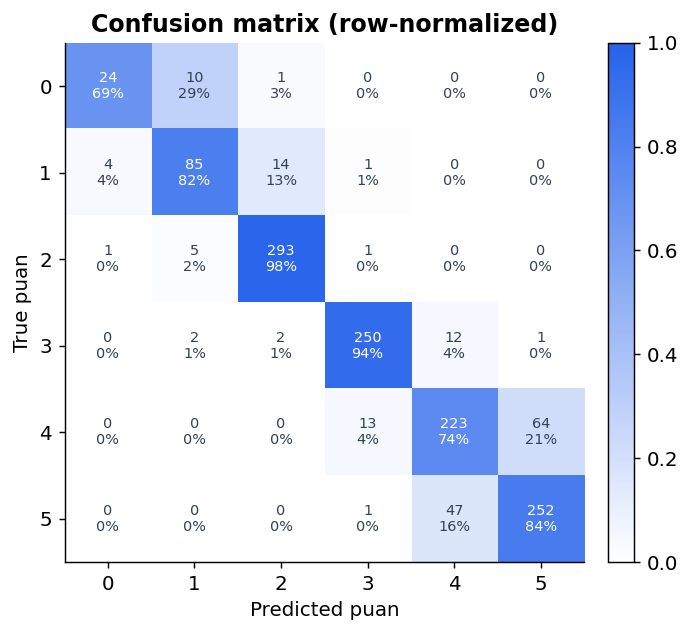
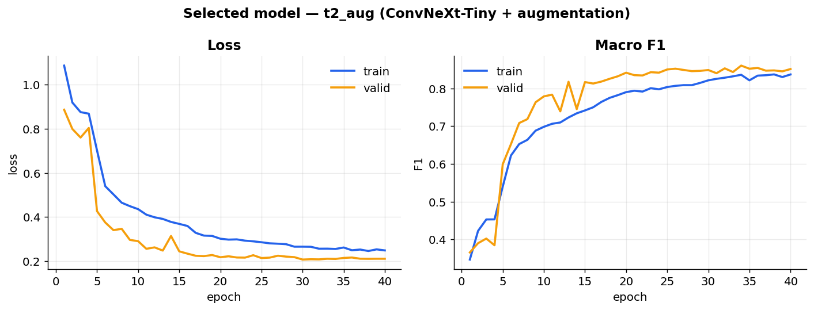
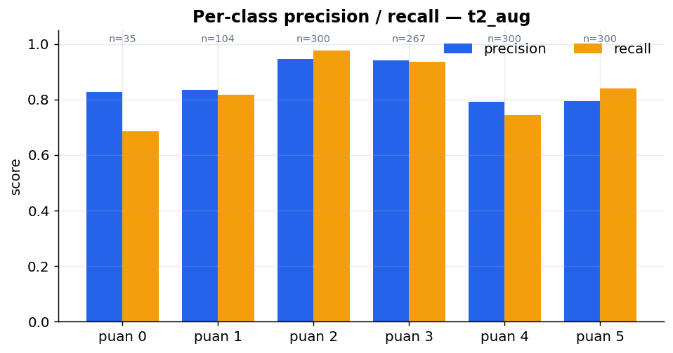
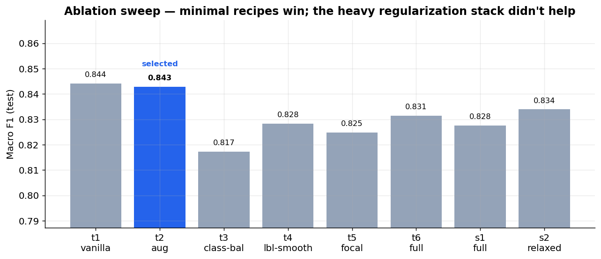
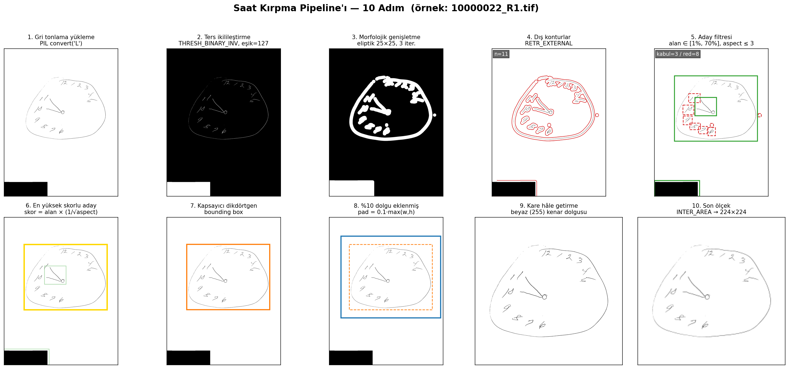

# Clock Drawing Test — Automated Severity Scoring

Deep-learning pipeline that reads a photographed **Clock Drawing Test (CDT)** and predicts its
clinical **`puan` score (0–5)** — a screening signal for cognitive impairment. A single ConvNeXt
classifier turns a raw clock photo into an ordinal score and a coarse 3-band severity label
(*Şiddetli / Orta / Sağlıklı*).

<p align="center">
  
  
</p>

---

## Highlights

- **End-to-end pipeline:** automatic clock detection & cropping → augmentation → 6-class
  ConvNeXt classifier → ordinal score + clinical severity band.
- **Principled model selection:** an 8-step ablation sweep (`t1 … t6`, plus two backbone variants)
  isolating the contribution of each mechanism — augmentation, class balancing, label smoothing,
  focal loss, and an ordinal regularizer.
- **Honest, reproducible results** on a held-out test set of **1,306** images.
- **Key finding:** on this dataset a *minimal* recipe (pretrained backbone + augmentation) matches
  or beats a heavily-regularized stack — a reminder that complexity is not free.

---

## Results — selected model `t2_aug`

**ConvNeXt-Tiny** (ImageNet-22k → 1k pretrained, 224 px) fine-tuned with strong augmentation only.

| Metric | Score |
|---|---|
| Macro F1 (6-class) | **0.843** |
| Accuracy (6-class) | **0.863** |
| Mean Absolute Error | **0.142** |
| Severity Accuracy (3-band) | **0.961** |
| Severity Macro F1 (3-band) | **0.948** |

Because the score is **ordinal**, MAE matters as much as accuracy: an MAE of `0.14` means the model
is on average less than a sixth of a point away from the clinician's score, and the confusion matrix
above shows nearly all errors fall on *adjacent* classes (4↔5, 0↔1) rather than large jumps.

### Per-class behaviour

<p align="center">
  
</p>

The well-represented mid classes (`puan 2`, `puan 3`) reach 94–98 % recall. The hardest class is the
rare, most-severe `puan 0` (only 347 samples in the full set) — the primary target for future work.

---

## Why `t2_aug`? — the ablation sweep

Each preset adds **one** mechanism on top of the previous, so the marginal value of every trick is
measurable rather than assumed.

<p align="center">
  
</p>

| Preset | Added mechanism | Macro F1 | Acc | MAE |
|---|---|---|---|---|
| `t1_vanilla` | baseline (pretrained, no tricks) | 0.844 | 0.845 | 0.160 |
| **`t2_aug`** | **+ strong augmentation** | **0.843** | **0.863** | **0.142** |
| `t3_class_balance` | + class weights + weighted sampler | 0.817 | – | – |
| `t4_label_smooth` | + label smoothing | 0.828 | – | – |
| `t5_focal` | + focal loss | 0.825 | – | – |
| `t6_full` | + ordinal regularizer + drop-path | 0.831 | 0.846 | 0.161 |
| `s1_full` | ConvNeXt-**Small**, full stack | 0.828 | 0.842 | 0.166 |
| `s2_relaxed` | ConvNeXt-Small, lighter regularization | 0.834 | – | – |

`t1_vanilla` and `t2_aug` sit at the top and are statistically a tie on macro-F1. **`t2_aug` is
selected** because at equal macro-F1 it delivers clearly higher accuracy (+1.8 pp) and lower MAE
(0.142 vs 0.160), and augmentation gives better generalization on photographed clocks (lighting,
rotation, paper texture). Stacking class-balancing, focal loss and ordinal regularization on top
**did not help** here — the larger Small backbone with the full stack actually regressed.

The drop at `t3_class_balance` (0.844 → 0.817) is the clearest signal: it enables the weighted
sampler **and** the class-weighted loss at the same time, which double-corrects for imbalance — the
sampler already rebalances each batch, so reweighting the loss on top over-emphasizes the minority
classes. On a dataset already capped to ≤3,000/class the imbalance is mild enough that this hurts
more than it helps, which is why the **selected model leaves both off** and relies on augmentation
alone.

---

## Preprocessing — clock detection & crop

Raw submissions are full-page photos. A classical CV stage (contour detection → largest circular
region → square crop with padding) isolates the clock before it ever reaches the network.

<p align="center">
  
</p>

---

## Dataset

| Split | Images |
|---|---|
| Train | 10,440 |
| Validation | 1,306 |
| Test | 1,306 |
| **Total** | **13,052** |

Class distribution (capped at 3,000/class to limit imbalance): `puan 0: 347 · 1: 1,036 · 2: 3,000 ·
3: 2,669 · 4: 3,000 · 5: 3,000`. The dataset itself is **not** included in this repository.

---

## Repository layout

```
config.py               Central Config dataclass (paths, hyper-parameters, toggles)
experiments.py          Ablation presets (t1…t6, s1, s2) + preset application
model.py                ConvNeXt backbone + single 6-class head
dataset.py / augment.py Data loading, splitting, weighted sampling, transforms
losses.py               Focal cross-entropy + ordinal expectation regularizer
engine.py               Training / validation loop, scheduling, checkpointing
train.py                Train one preset
evaluate.py             Test-set metrics, confusion matrix, severity bands, optional TTA
run_all_experiments.py  Drive the full ablation sweep end-to-end
plot_training.py        Training-curve plots
make_comparison_pdf.py / make_dataset_model_pdf.py   Reporting
_crop_puan_345.py, recrop_uncropped.py, _viz_crop_pipeline.py,
clean_labels.py, apply_*.py                          Data-prep / labeling utilities
```

---

## Getting started

```bash
# 1. Install (CUDA-enabled PyTorch recommended — see requirements.txt header)
pip install -r requirements.txt

# 2. Point the pipeline at your dataset (folder holding master_etiketler.csv +
#    processed/{0..5}/). Defaults to ./data/master_veri if unset.
export CDT_DATA_ROOT=/path/to/master_veri        # Windows: set CDT_DATA_ROOT=...

# 3. Train the selected model. The CFG defaults already match `t2_aug`, so a
#    bare `python train.py` reproduces it; the explicit preset is equivalent.
python train.py                  # or: python train.py --preset t2_aug

# 4. Evaluate on the test set (add --tta for test-time augmentation)
python evaluate.py --preset t2_aug

# 5. Or reproduce the entire ablation sweep
python run_all_experiments.py
```

Model checkpoints and per-run logs/metrics are written under `outputs/puan/`
(git-ignored — they are regenerated by training).

---

## Tech stack

Python · PyTorch · timm (ConvNeXt) · OpenCV · scikit-learn · pandas · matplotlib

---

<sub>Built as an applied computer-vision project on ordinal medical-image classification:
preprocessing, class imbalance, ordinal loss design, and disciplined ablation-driven model selection.</sub>
